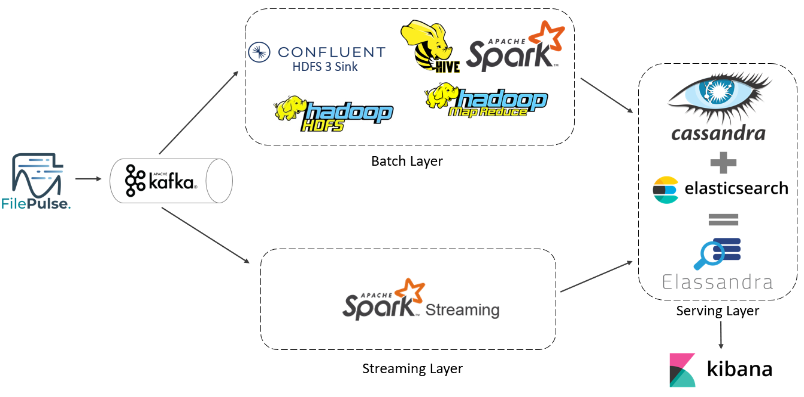

# lambda-architecture

Questo repository contiene il codice relativo al progetto svolto da Andrea Mariani, Gianluca Mariani e Marco D'Elia,
relativo al corso di [Big Data](http://torlone.dia.uniroma3.it/bigdata/),
tenuto dal prof. [Riccardo Torlone](http://torlone.dia.uniroma3.it/),
nell'anno accademico 2020-2021,
con riferimento all'implementazione di un'architettura lambda.

## Accesso al repository 

Per effettuare il download del repository:

    git clone https://github.com/mdelia17/lambda-architecture.git

Oppure se il sistema host è Windows:

    git clone --config core.autocrlf=input https://github.com/mdelia17/lambda-architecture.git

Per aggiornare il contenuto della propria copia locale del repository: 

    git pull 

## Organizzazione del repository 

Questo repository è organizzato in diverse sezioni (cartelle):
* [kafka](kafka/): contenente il docker-compose, i file e gli script necessari per l'avvio e l'esecuzione di tutti i componenti dello strato data broker;
* [cassandra](cassandra/): contenente il docker-compose, i file e gli script necessari per l'avvio e l'inizializzazione del cluster Elassandra, la creazione dell'indice Elasticsearch e per il caricamento della visualizzazione Kibana;
* [lambda](lambda/): contenente il docker-compose, i file e gli script necessari per l'avvio e l'esecuzione di tutti i componenti degli strati batch e streaming.

## Prerequisiti

Per utilizzare il repository è necessario avere installato:
* [Docker] 20.10.4;
* [Docker Compose] 1.29.2;

Nel caso in cui si utilizzi una macchina EC2, è necessario avere installato Git per effettuare il clone del repository dentro di essa. Per l'esecuzione in locale passare alla sezione successiva, mentre su EC2 è necessario effettuare i seguenti comandi:
* aggiungere al file /etc/sysctl.conf la riga `vm.max_map_count = 262144`
* sostituire la property options nel file /etc/sysconfig/docker con `OPTIONS="--default-ulimit nofile=65536:65536"`
* eseguire `sudo /sbin/sysctl -p` e `sudo systemctl restart docker`

Inoltre, per l'accesso alle diverse interfacce web, è necessario aggiungere al gruppo di sicurezza della macchina una regola di traffico inbound.

## Utilizzo del repository

Per l'avvio, la configurazione e l'esecuzione dell'architettura è necessario aprire tre shell, ciascuna posizionata in una delle tre cartelle (kafka, lambda, cassandra).

Nel tab kafka:
* avviare i contenitori con `docker-compose up -d`
* eseguire `sh status-prod-connector.sh` per controllare lo stato del connettore
* quando il connettore è avviato correttamente, eseguire `sh create-producer-connector.sh` per creare un'istanza del produttore
* quando il produttore è avviato correttamente, eseguire `sh init-producer.sh` per inizializzare la cartella su cui il produttore è in ascolto

Nel tab cassandra:
* avviare i contenitori con `docker-compose up -d`
* quando il cluster cassandra è avviato correttamente, eseguire `sh init-schema.sh`
* eseguire `sh init-indexes.sh` per creare gli indici di Elasticsearch

Nel tab lambda:
* avviare i contenitori con `docker-compose up -d`
* eseguire `sh status-cons-connector.sh` per controllare lo stato del connettore
* quando il connettore è avviato correttamente, eseguire `sh create-consumer-connector.sh` per creare un'istanza del consumatore
* eseguire `sh init-python.sh` per installare i software necessari per l'esecuzione sui diversi nodi
* eseguire `sh init-jobs.sh` per copiare sui contenitori i file per l'esecuzione dei diversi job

A questo punto, l'architettura è pronta per l'esecuzione vera e propria. Per iniziare la produzione di messaggi, eseguire nel tab kafka `sh start-producer.sh`. Per avviare i diversi job (divisi nelle cartelle /streaming, /batch, /mapreduce e /hive dentro la cartella /lambda), nel tab lambda eseguire `sh start-job-streaming.sh`, `sh start-job-batch.sh`, `sh start-job-mapreduce.sh` o `sh start-job-hive.sh` passando come parametro il nome del job senza l'estensione.
Inoltre, è possibile nel tab cassandra eseguire `sh cqlsh.sh` per accedere all'interfaccia cqlsh del cluster Cassandra. Per la visualizzazione, è possibile importare il file /cassandra/kibana.json nell'interfaccia web in ascolto sulla porta :5601.
